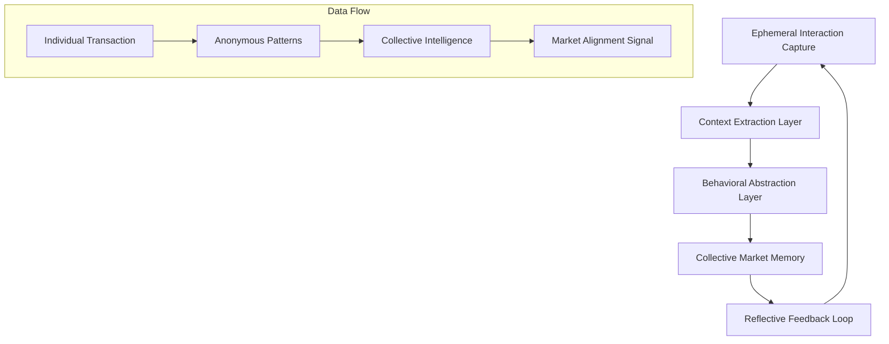

# MandiSense Design Document

## Overview

MandiSense represents a fundamental shift from traditional market platforms. Rather than connecting buyers and sellers, it creates collective market intelligence. The system transforms ephemeral human interactions into persistent market memory, enabling markets to remember and reflect without judging or controlling.

The design centers on a single innovation: the Market Alignment Signal - an AI-generated reflection that emerges from thousands of anonymous interactions and influences future negotiations through contextual awareness rather than algorithmic authority.

## Design Philosophy

### Why Anonymity is a Design Choice, Not a Limitation

Traditional market platforms accumulate individual reputation to create trust. MandiSense inverts this: it accumulates collective behavioral patterns while deliberately discarding individual identity. This is not a privacy compromise - it's the core innovation. Individual reputation creates power imbalances and gaming incentives. Collective memory creates market intelligence without individual vulnerability.

### Why the System Reflects Instead of Decides

Markets fail when external authorities impose "optimal" prices or behaviors. MandiSense provides a mirror, not a rulebook. The Market Alignment Signal says "This negotiation pattern differs from collective behavior" rather than "This price is wrong." Participants retain full agency while gaining collective context they previously lacked.

### Why Behavior is Abstracted Rather than Stored

Raw transaction data creates liability and enables surveillance. Behavioral abstraction creates intelligence. When a negotiation concludes, individual details dissolve into patterns: "aggressive opening offers followed by gradual concessions" becomes part of collective memory while "Raj offered ₹50 for tomatoes" disappears forever.

### AI as Civic Mirror, Not Authority

The system's AI doesn't optimize or recommend - it reflects. Like a civic mirror, it shows the market to itself: "Your current negotiation style aligns with patterns that typically build long-term trust" or "This pricing approach differs significantly from recent collective behavior." The market decides; the AI illuminates.

## Architecture

MandiSense operates through five interacting layers that transform individual interactions into collective intelligence:



### Layer 1: Ephemeral Interaction Capture

**Purpose**: Record negotiation dynamics without creating permanent individual records.

**Process**: 
- Audio/text input flows through real-time translation
- Negotiation patterns are extracted (offer sequences, response timing, concession patterns)
- Individual identifiers are immediately stripped
- Raw interaction data has a 24-hour maximum lifespan

**Key Innovation**: The system captures behavioral essence while discarding individual traces. A negotiation becomes "Pattern Type 7: Gradual mutual concession with trust-building language" rather than a specific conversation between specific people.

### Layer 2: Context Extraction Layer

**Purpose**: Transform raw interactions into meaningful behavioral components.

**Process**:
- Extract negotiation dynamics (opening positions, concession rates, agreement patterns)
- Identify communication styles (collaborative, competitive, trust-building)
- Capture pricing patterns relative to market context
- Abstract temporal patterns (time to agreement, negotiation phases)

**Key Innovation**: Context extraction focuses on "how people negotiate" rather than "what people buy." The system learns negotiation DNA, not transaction history.

### Layer 3: Behavioral Abstraction Layer

**Purpose**: Convert individual behavioral components into anonymous collective patterns.

**Process**:
- Cluster similar negotiation patterns across participants
- Identify recurring behavioral sequences
- Abstract individual actions into pattern types
- Generate behavioral fingerprints without individual attribution

**Key Innovation**: This layer is where individual identity dissolves completely. Behavioral patterns become mathematical abstractions that inform collective intelligence while making individual reconstruction impossible.

### Layer 4: Collective Market Memory

**Purpose**: Maintain evolving intelligence about market behavior patterns.

**Process**:
- Integrate new behavioral abstractions into existing pattern knowledge
- Identify shifts in collective negotiation behavior over time
- Maintain statistical models of "typical" vs "atypical" market behavior
- Evolve understanding of what constitutes fair and effective negotiation

**Key Innovation**: The memory is truly collective - it belongs to no individual and serves the entire market ecosystem. It remembers patterns that build trust and identifies behaviors that typically lead to market dysfunction.

### Layer 5: Reflective Feedback Loop

**Purpose**: Generate contextual Market Alignment Signals that influence future negotiations.

**Process**:
- Compare current negotiation patterns to collective memory
- Generate contextual reflections about alignment with typical market behavior
- Provide signals that inform without coercing
- Maintain silence when meaningful guidance cannot be provided

**Key Innovation**: The feedback loop creates market self-awareness. Participants see their behavior in the context of collective patterns, enabling market-driven improvement without external enforcement.

## Components and Interfaces

### Translation Engine

**Core Function**: Enable seamless multilingual negotiation.

**Interface Design**:
```
[Speaker A: Hindi] → [Real-time translation] → [Speaker B: Tamil]
[Context preservation] → [Emotional tone maintenance] → [Cultural adaptation]
```

**Key Features**:
- Supports 10 primary Indian languages
- Preserves negotiation intent and emotional context
- Adapts cultural communication styles
- Operates with sub-second latency

### Price Context Engine

**Core Function**: Provide market price awareness without prescriptive guidance.

**Interface Design**:
```
Current Market Context:
Tomatoes: ₹15-25/kg (typical range)
Demand: Moderate ↗ (trending up)
Recent patterns: Gradual price increases over 3 days
```

**Key Features**:
- Displays price ranges, never specific "correct" prices
- Shows demand trends without predictions
- Provides context for informed decision-making
- Updates in real-time based on collective market activity

### Market Alignment Signal Generator

**Core Function**: Reflect negotiation behavior against collective market patterns.

**Signal Examples**:
- "This negotiation style aligns with patterns that typically build long-term market relationships"
- "This pricing approach differs significantly from recent collective behavior"
- "This agreement pattern matches successful negotiations in similar market conditions"
- [Silence when meaningful guidance cannot be provided]

**Key Features**:
- Generates contextual, non-judgmental reflections
- Focuses on behavioral alignment rather than price optimization
- Provides market intelligence without coercion
- Maintains participant agency while offering collective wisdom

## Data Models

### Behavioral Pattern Model

```
BehavioralPattern {
  pattern_id: UUID
  pattern_type: Enum[collaborative, competitive, trust_building, efficiency_focused]
  negotiation_sequence: Array[negotiation_phases]
  typical_outcomes: OutcomeStatistics
  market_context: MarketConditions
  temporal_signature: TimePattern
  abstraction_level: Integer[1-5]  // Higher = more anonymous
}
```

### Market Memory Model

```
CollectiveMemory {
  memory_id: UUID
  behavioral_patterns: Array[BehavioralPattern]
  market_health_indicators: HealthMetrics
  trust_evolution: TrustTrends
  fairness_patterns: FairnessMetrics
  temporal_evolution: TimeSeriesData
  confidence_level: Float[0-1]
}
```

### Alignment Signal Model

```
AlignmentSignal {
  signal_id: UUID
  signal_text: String
  confidence_level: Float[0-1]
  context_factors: Array[ContextFactor]
  behavioral_basis: Array[PatternReference]
  temporal_relevance: Duration
  cultural_adaptation: CulturalContext
}
```

## Correctness Properties

*A property is a characteristic or behavior that should hold true across all valid executions of a system - essentially, a formal statement about what the system should do. Properties serve as the bridge between human-readable specifications and machine-verifiable correctness guarantees.*

Before defining the correctness properties, I need to analyze which acceptance criteria from the requirements are testable through property-based testing.

### Property Reflection

After analyzing all acceptance criteria, I identified several areas where properties can be consolidated:

**Translation Properties**: Properties 1.1, 1.2, and 1.5 all test translation functionality and can be combined into comprehensive translation correctness properties.

**Privacy Properties**: Properties 3.1, 3.3, 3.4, 3.5, 6.1, 6.3, 8.2, 8.3, and 8.4 all test various aspects of privacy and anonymization and can be consolidated into core privacy properties.

**Price Context Properties**: Properties 2.1, 2.3, 2.4, and 2.5 test different aspects of price context provision and can be combined.

**Market Memory Properties**: Properties 4.1, 4.2, 4.4, and 4.5 test collective memory formation and can be consolidated.

**Signal Generation Properties**: Properties 5.1, 5.2, 5.3, and 5.4 test Market Alignment Signal characteristics and can be combined.

### Correctness Properties

**Property 1: Translation Preserves Negotiation Context**
*For any* negotiation text in supported Indian languages, translating to another supported language should preserve the semantic meaning, emotional tone, and negotiation intent of the original communication.
**Validates: Requirements 1.1, 1.2, 1.5**

**Property 2: Price Context Provides Ranges Without Recommendations**
*For any* commodity negotiation, the price context should display ranges and trends without ever claiming to provide "best price" or "optimal price" recommendations.
**Validates: Requirements 2.1, 2.3, 2.4, 2.5**

**Property 3: Market Updates Propagate Within Time Bounds**
*For any* market condition change, price context updates should propagate to all active negotiations within 30 seconds.
**Validates: Requirements 2.2**

**Property 4: Behavioral Capture Excludes Personal Identity**
*For any* captured negotiation interaction, the extracted behavioral patterns should contain negotiation dynamics, pricing patterns, and agreement characteristics while containing zero personally identifiable information.
**Validates: Requirements 3.1, 3.2, 3.3**

**Property 5: Data Anonymization is Irreversible**
*For any* behavioral abstraction stored in the collective memory, it should be impossible to reconstruct individual transaction details or trace patterns back to specific participants.
**Validates: Requirements 3.4, 3.5, 8.3, 8.4**

**Property 6: Collective Memory Integration**
*For any* new behavioral pattern, integrating it into the collective market memory should enhance pattern recognition and market intelligence without storing individual transaction histories.
**Validates: Requirements 4.1, 4.2, 4.5**

**Property 7: Deviation Detection Without Individual Judgment**
*For any* market behavior analysis, the system should detect deviations from typical patterns while ensuring no individual participant judgments or permanent ratings are created.
**Validates: Requirements 4.3, 6.1, 6.4**

**Property 8: Market Alignment Signal Generation**
*For any* concluded negotiation, if sufficient collective pattern data exists, a contextual Market Alignment Signal should be generated that reflects market alignment rather than individual compliance.
**Validates: Requirements 5.1, 5.2, 5.3**

**Property 9: Appropriate System Silence**
*For any* situation where meaningful alignment context cannot be provided, the system should remain silent rather than generate misleading or low-confidence guidance.
**Validates: Requirements 5.5**

**Property 10: Ephemeral Signal Characteristics**
*For any* Market Alignment Signal generated, it should be contextual to the current negotiation, not permanently stored, and use empowering rather than punitive language.
**Validates: Requirements 5.4, 6.2**

**Property 11: Feedback Privacy**
*For any* feedback or Market Alignment Signal, it should be visible only to the current negotiation participants and never publicly displayed.
**Validates: Requirements 6.5, 6.3**

**Property 12: Data Processing Time Bounds**
*For any* captured interaction data, behavioral abstraction should complete within 24 hours, after which raw interaction data should be automatically deleted.
**Validates: Requirements 8.1, 8.2**

**Property 13: Minimal Data Retention**
*For any* data retention, only the minimum necessary for collective memory formation should be maintained, with aggregate behavioral intelligence preferred over individual details.
**Validates: Requirements 8.5**

**Property 14: Indian Market Pattern Recognition**
*For any* negotiation processing, the system should recognize and accommodate oral negotiation patterns, fluid pricing, trust-based trading, and high-frequency low-margin trade characteristics typical of Indian mandis.
**Validates: Requirements 7.1, 7.2, 7.3, 7.4, 7.5**

**Property 15: Positive Pattern Reinforcement**
*For any* behavioral pattern showing improvement toward fairness, the system should generate Market Alignment Signals that reinforce positive market dynamics.
**Validates: Requirements 9.3, 9.5**

**Property 16: Interface Information Prioritization**
*For any* interface display, translation functionality, price context, and Market Alignment Signals should be prioritized and presented using concise, culturally appropriate language accessible across literacy levels.
**Validates: Requirements 10.2, 10.4, 10.5**

## Error Handling

### Translation Engine Error Handling

**Language Detection Failures**: When language detection fails, the system defaults to Hindi-English translation while displaying a language selection interface.

**Translation Quality Issues**: When translation confidence falls below 85%, the system displays both original and translated text with a quality indicator.

**Real-time Processing Delays**: When translation latency exceeds 2 seconds, the system displays partial translations and completion indicators.

### Price Context Engine Error Handling

**Market Data Unavailability**: When current market data is unavailable, the system displays historical context with clear temporal indicators and confidence levels.

**Commodity Recognition Failures**: When commodity identification fails, the system requests clarification while providing general market context.

**Data Freshness Issues**: When market data is older than 1 hour, the system displays staleness indicators and reduced confidence signals.

### Collective Memory Error Handling

**Insufficient Pattern Data**: When collective memory lacks sufficient patterns for meaningful analysis, the system remains silent rather than generating low-confidence signals.

**Memory Corruption Detection**: When behavioral pattern integrity checks fail, the system isolates corrupted data and continues operation with remaining patterns.

**Abstraction Failures**: When behavioral abstraction cannot ensure anonymity, the system discards the data rather than risk privacy violations.

### Market Alignment Signal Error Handling

**Low Confidence Scenarios**: When signal confidence falls below 70%, the system remains silent rather than providing potentially misleading guidance.

**Cultural Context Failures**: When cultural adaptation cannot be ensured, the system defaults to neutral, universally appropriate language.

**Signal Generation Timeouts**: When signal generation exceeds 5 seconds, the system proceeds without a signal rather than delaying the negotiation.

## Testing Strategy

### Dual Testing Approach

MandiSense requires both unit testing and property-based testing to ensure correctness across the complex behavioral abstraction and collective intelligence systems.

**Unit Tests** focus on:
- Specific translation examples for each supported language pair
- Edge cases in behavioral pattern recognition
- Error conditions in market data processing
- Integration points between system layers
- Cultural adaptation examples

**Property Tests** focus on:
- Universal properties that hold across all negotiations
- Comprehensive input coverage through randomization
- Privacy and anonymization guarantees
- Market alignment signal consistency
- Collective memory evolution patterns

### Property-Based Testing Configuration

**Testing Framework**: Use Hypothesis for Python implementation or fast-check for TypeScript implementation.

**Test Configuration**: Each property test must run minimum 100 iterations to ensure comprehensive coverage through randomization.

**Test Tagging**: Each property-based test must include a comment referencing its design document property:
```python
# Feature: mandi-sense, Property 1: Translation Preserves Negotiation Context
def test_translation_preserves_context(negotiation_text, source_lang, target_lang):
    # Test implementation
```

**Property Test Requirements**:
- Each correctness property must be implemented by exactly one property-based test
- Tests must generate realistic negotiation scenarios and market conditions
- Privacy properties must use adversarial testing to verify anonymization
- Market alignment properties must test across diverse behavioral patterns
- Cultural adaptation properties must test across all supported languages

### Integration Testing Strategy

**Layer Integration Tests**: Verify data flow between the five system layers maintains integrity and anonymization.

**End-to-End Negotiation Tests**: Test complete negotiation flows from multilingual input through Market Alignment Signal generation.

**Privacy Verification Tests**: Adversarial testing to ensure individual transaction reconstruction is impossible.

**Performance Tests**: Verify real-time translation and signal generation meet latency requirements.

**Cultural Adaptation Tests**: Verify system behavior across different Indian market contexts and languages.

### Testing Data Strategy

**Synthetic Negotiation Data**: Generate realistic negotiation scenarios across different commodities, languages, and cultural contexts.

**Behavioral Pattern Libraries**: Create libraries of known negotiation patterns for testing collective memory formation.

**Adversarial Privacy Testing**: Attempt to reverse-engineer individual transactions from collective memory to verify anonymization.

**Market Condition Simulation**: Simulate various market conditions to test price context and alignment signal accuracy.

The testing strategy ensures MandiSense maintains its core promises: effective multilingual negotiation support, robust privacy protection, and meaningful collective market intelligence without individual surveillance or coercion.